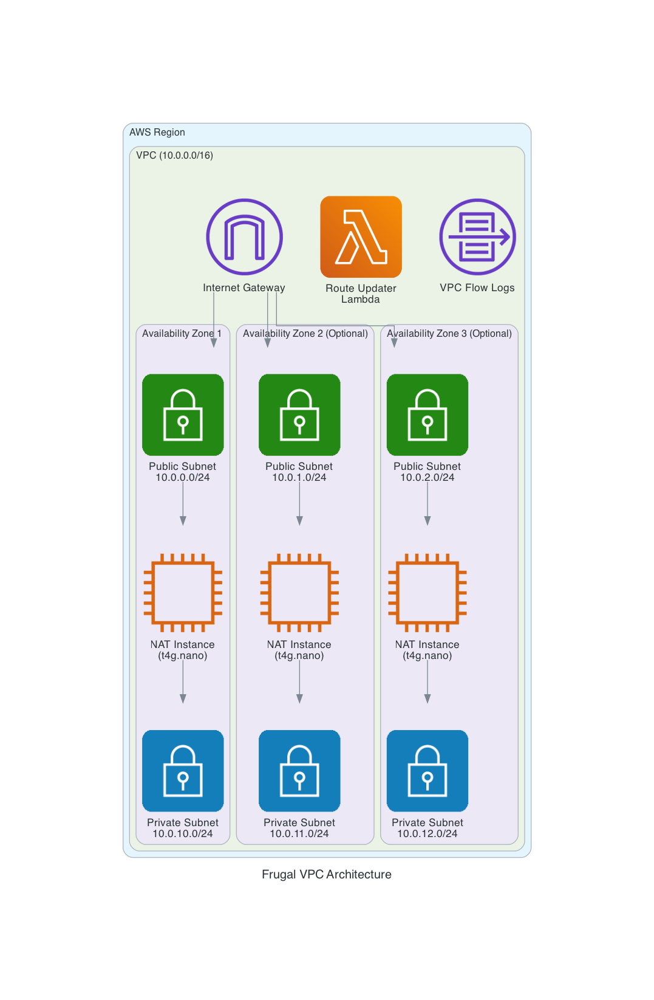

# Frugal VPC

A cost-optimized AWS VPC CloudFormation template that uses NAT instances instead of NAT Gateways to significantly reduce networking costs while maintaining high availability and automatic failover capabilities.

## Purpose

This project provides a production-ready VPC infrastructure that prioritizes cost efficiency without sacrificing reliability. By using auto-scaling NAT instances instead of managed NAT Gateways, you can reduce your monthly NAT costs by up to 90% while still maintaining:

- High availability across multiple AZs
- Automatic failover and recovery
- Configurable spot instance support for maximum savings
- VPC Flow Logs for monitoring and troubleshooting

## Architecture

### Components Deployed

**Core Networking:**
- VPC with configurable CIDR block (default: 10.0.0.0/16)
- Internet Gateway for public internet access
- Public and private subnets across 1-3 availability zones with configurable subnet sizes
- Route tables with automatic route management

**NAT Infrastructure:**
- Auto Scaling Groups with NAT instances (t4g.nano ARM-based instances)
- Configurable spot instance support across all AZs (up to 70% additional savings)
- Automatic source/destination check disabling
- Custom security groups for NAT traffic

**Automation & Monitoring:**
- Lambda function (Python 3.14) for automatic route table updates
- EventBridge rules for instance state change monitoring
- VPC Flow Logs with 7-day retention
- CloudWatch integration for monitoring

**Security & Patching:**
- Daily automatic security updates via dnf-automatic
- Weekly SSM maintenance window with AWS-RunPatchBaseline as backup
- SSM Session Manager access for instance management

**Cost Optimization Features:**
- ARM-based t4g.nano instances (lowest cost option)
- Optional spot instances for non-critical workloads
- Minimal instance footprint with efficient NAT configuration
- Automatic scaling to maintain exactly one NAT instance per AZ

## Cost Comparison

| Component | NAT Gateway (Monthly) | Frugal VPC (Monthly) | Savings |
|-----------|----------------------|---------------------|---------|
| 1 AZ Setup | ~$45 | ~$3-6 | 85-93% |
| 3 AZ Setup | ~$135 | ~$9-18 | 85-93% |

*Costs based on us-east-1 pricing and typical usage patterns*

## Quick Start

See [quickstart.md](quickstart.md) for detailed deployment instructions with four configuration options:
1. Single AZ with spot instances (maximum cost savings)
2. Single AZ with on-demand instances (balanced cost/reliability)
3. Multi-AZ with on-demand instances (production-ready high availability)
4. Multi-AZ with spot instances (dev environments requiring multiple AZs)

## Key Features

- **Configurable AZ Count**: Deploy across 1-3 availability zones
- **Spot Instance Support**: Optional spot instances across all AZs for maximum cost savings
- **Auto-Recovery**: Automatic replacement of failed NAT instances
- **Custom Scripts**: Support for custom Python scripts on NAT instances
- **Flow Logs**: Built-in VPC flow logging for network monitoring
- **ARM Architecture**: Uses efficient ARM-based instances for lower costs
- **Security Patching**: Daily automatic security updates with weekly SSM patching as backup

## Use Cases

- Development and testing environments
- Cost-sensitive production workloads
- Startups and small businesses
- Proof-of-concept deployments
- Any scenario where NAT Gateway costs are prohibitive

## Limitations

- NAT instances have lower throughput than NAT Gateways
- Spot instances may be interrupted (use on-demand for critical workloads)
- Requires more operational overhead than managed NAT Gateways
- Single point of failure per AZ (mitigated by auto-scaling)

## License

This project is licensed under the MIT License - see the [LICENSE](LICENSE) file for details.
